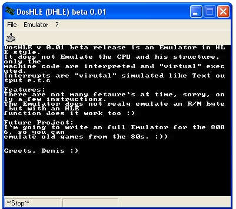



## x86 Emulator \(DosHLE\) v 0\.2\!

### Description

This is a VB emualtor project for the Intel 8086

It opens .com files and emualte a few opcodes. My Idea was, to write a "retro" emualtor for old days who many peoble spend a lot time for. My Goal: Adlib emualtion, VGA/EGA and VESA emualtion. I`m going max. to the 80-286.

NEW 0.2. Now R/M byte is supported!!! + a few new

opcodes
 
### More Info
 

             |
---                |---
**Submitted On**   |2002-10-04 13:29:44
**By**             |[Denis Wiegand](https://github.com/Planet-Source-Code/PSCIndex/blob/master/ByAuthor/denis-wiegand.md)
**Level**          |Advanced
**User Rating**    |4.5 (67 globes from 15 users)
**Compatibility**  |VB 5\.0, VB 6\.0
**Category**       |[Files/ File Controls/ Input/ Output](https://github.com/Planet-Source-Code/PSCIndex/blob/master/ByCategory/files-file-controls-input-output__1-3.md)
**World**          |[Visual Basic](https://github.com/Planet-Source-Code/PSCIndex/blob/master/ByWorld/visual-basic.md)
**Archive File**   |[x86\_Emulat1404551042002\.zip](https://github.com/Planet-Source-Code/denis-wiegand-x86-emulator-doshle-v-0-2__1-39528/archive/master.zip)

